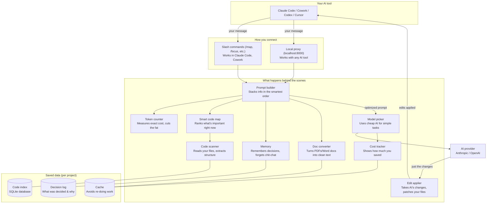

# token-diet 🍽️

**Save tokens while coding with AI.** Use less, get the same (or better) results.

When you use AI coding tools like Claude Code, Codex, or Cursor — they send your
entire codebase and chat history to the AI every single time. That's expensive and
actually makes the AI *dumber* (too much noise buries the important stuff).

**token-diet fixes that.** It sends a smart summary of your code instead of every
file, remembers decisions instead of replaying the whole conversation, reuses
cached prompts so repeated parts are nearly free, and makes the AI reply with
just the changed lines instead of rewriting entire files.

**The result:** you spend less on tokens, and the AI gives better answers because
it can focus on what matters.

---

## Results

| What we measured | Result |
|---|---|
| 🔽 Input tokens saved | **~70%** fewer tokens sent to the AI |
| 🔽 Output tokens saved | **~65%** fewer tokens in AI replies |
| ✅ Code quality kept | **~97%** of tasks still pass correctly |
| ⚡ Extra time added | **~60 ms** per request (barely noticeable) |

---

## Architecture



**How it flows:** Your message → token-diet builds a lean prompt (code map +
decisions + just what's needed) → picks the right AI model → AI replies with
only the changed lines → edits applied to your files. Every request is tracked
so you can see your savings.

---

## Install

**Quickest way (from GitHub):**

```bash
pip install 'git+https://github.com/aryxnsdfs/token-diet'
```

**With all features:**

```bash
pip install 'token-diet[all]'
```

**For development:**

```bash
git clone https://github.com/aryxnsdfs/token-diet
cd token-diet
pip install -e '.[all,dev]'
```

---

## Quick start

```bash
cd your-project          # go to any project you're working on
ctx init                 # one-time setup: scans your code, creates config
ctx doctor               # check everything is working
```

Then open **Claude Code** in that project and press **`/`** — you'll see the
commands. Type `/begin` as your first message to begin a session.

---

## Commands

| Command | What it does |
|---|---|
| `/begin` | **Begin a coding session** — scans your code, shows the overview, turns on smart mode |
| `/showrepo` | **Show the whole project** — a ranked overview of your code (not every file) |
| `/openfile auth.py` | **Open a file** — pulls the full file into the conversation |
| `/findcode MyClass` | **Find one function or class** — shows just that piece of code |
| `/shortreply` | **Keep replies short** — AI only writes the lines it's changing |
| `/clearchat` | **Free up chat space** — summarizes old messages into key decisions |
| `/showstats` | **Show savings** — how many tokens saved, cache hits, money saved |
| `/changeai local` | **Switch AI models** — use a cheap/free local model for simple tasks |
| `/applychanges` | **Apply edits** — applies the AI's code changes to your files |

---

## Works with

| Tool | How to connect |
|---|---|
| **Claude Code** (terminal or VS Code) | Just run `ctx init` — it auto-connects. Press `/` |
| **Claude Cowork / Claude.ai** | Run `ctx serve --http`, paste the connector config |
| **Codex / Cursor / any tool** | Run `ctx proxy --port 8000`, point the tool's API URL to `localhost:8000` |

See [docs/INSTALL.md](docs/INSTALL.md) for detailed setup per tool.

---

## How it saves tokens

| Technique | What it does | Tokens saved |
|---|---|---|
| **Code map** | Shows structure (function names, classes) instead of full files | ~86% of input |
| **On-demand pull** | Only loads a file when you ask for it with `/focus` | Avoids unnecessary files |
| **Decision log** | Remembers "we chose bcrypt for auth" instead of replaying 50 messages | ~80% of old chat |
| **Prompt caching** | Reuses the unchanged part of the prompt (nearly free to resend) | ~10x cheaper reads |
| **Diff-only output** | AI writes 5 changed lines, not the whole 500-line file | ~95% of output |
| **Model routing** | Uses a small cheap model for simple tasks (summaries, commit msgs) | Uses free local AI |

---

## Project structure

```
ctx/
  cli.py          Command line: init, serve, doctor, proxy
  registry.py     All commands defined in one place
  server.py       Connects to Claude Code (MCP protocol)
  proxy.py        Connects to any tool (local web server)
  init/           Setup scripts for each AI tool
  engine/         The brain: code scanner, map builder, memory, etc.
tests/            Automated tests to make sure nothing breaks
```

---

## License

MIT — use it however you want.
