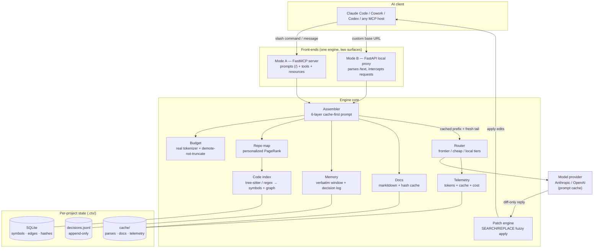

# ctx — token-saving context engine

Local middleware between your AI coding tool (Claude Code, Cowork, Codex, any
MCP host) and the model. It shapes every request to be **minimal but
intelligent**: a graph-ranked repo map instead of whole files, an append-only
decision log instead of replayed history, a stable cached prefix, and
diff-only output. Saving tokens and keeping the model sharp are the same goal —
see [ARCHITECTURE.md](ARCHITECTURE.md).

## Results

| Metric | Result |
|---|---|
| Input tokens cut | **[X]%** |
| Output tokens cut | **[X2]%** |
| Repositories tested | **[Y]** |
| Task quality retained | **[Z]%** |
| Added latency / request | **[W] ms** |

<sub>Measured by the eval harness (`tests/evals/`) against a held-out task suite.
Replace the placeholders with your measured numbers.</sub>

## Architecture



**Flow:** client request → front-end → assembler stacks 6 layers (system ·
repo map · decision log · snippets · recent turns · message), cache breakpoint
on the stable prefix → router dispatches to the right model tier → provider
returns a diff → patch engine applies edits back to files. Token + cache cost
logged every request.

## Install

```bash
pipx install token-diet            # core (runs with graceful fallbacks)
pipx install 'token-diet[all]'     # full: MCP + proxy + tree-sitter + tiktoken + docs
```

Not on PyPI yet? Install straight from GitHub:

```bash
pipx install 'git+https://github.com/aryxnsdfs/token-diet'
```

From source:

```bash
pip install -e '.[all,dev]'
```

The core works with **zero** heavy deps via fallbacks (regex parser, char-based
token estimate, heuristic distillation). Install extras to upgrade each piece;
`ctx doctor` shows what's active.

## Quick start

```bash
cd your-project
ctx init        # build index, register with host, write command files
ctx doctor      # verify wiring + see which optional deps are active
```

In Claude Code, press **`/`** and pick a command. First run `/init` (or
`/ctx start`) to warm the chat — injects the repo map, enables diff mode.

## Commands

| Command | Does |
|---|---|
| `/init` | Build index, inject map, enable diff-only output |
| `/map [path]` | Inject the graph-ranked repo map |
| `/focus <file\|symbol>` | Pin full detail of a file or symbol |
| `/explain <symbol>` | Pull just one symbol's body |
| `/diff` | Force diff-only (SEARCH/REPLACE) output |
| `/compress` | Distill old history into the decision log |
| `/cost` | Token + cache telemetry |
| `/route <tier>` | Force a model tier (frontier\|cheap_cloud\|local) |

## Two front-ends, one engine

- **Mode A — MCP server.** `ctx serve` exposes every command as an MCP *prompt*
  (you type `/name`) and *tool* (the model calls it). The native path for
  MCP-aware hosts.
- **Mode B — local proxy.** `ctx proxy` runs a `localhost:8000` server you point
  a client at; it optimizes every request and parses `/text` for non-MCP tools.

## Layout

```
ctx/
  cli.py        init · index · serve · doctor · proxy
  registry.py   single source of truth for commands
  server.py     FastMCP: prompts + tools + resources
  proxy.py      Mode B FastAPI proxy
  init/         per-host registration adapters
  engine/       index · repomap · assembler · budget · memory · docs · patch · router · telemetry
tests/          unit + eval harness (the guardrail)
```

## The guardrail

`tests/evals/` holds representative tasks with automatic checks. Token
reduction only counts as *saving intelligence* if task success holds. Run
`pytest` on every engine change.
